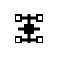

<p align="center">
  
</p>

# Root Logos

Root Logos is a living, corrigible constitutional grammar for composing coherent
participation in reality.

The site is not organized as a blog, feed, dashboard, or publication archive.
It is one continuously readable, versioned knowledge system whose public surface
and documentary record are views of the same constitutional network:
Logoi, vocabulary, Living Statements, Constitutional Bridges, Field Notes,
Artifact Seeds, Open Questions, Export Packets, and published revisions.

The current constitution is **Revision 0.6 — The Attractor Membrane**.
Its direction is both expansive and compressive: the architecture names new
distinctions when required, then seeks the smallest relational grammar capable
of carrying them without doctrinal repetition.

## Current Shape

- `index.html` renders the public Root Logos interface: interactive network field,
  constitutional relationship ledger, document, search, export review, open
  questions, and revision history.
- `content/constitutional-graph.json` is the typed graph that defines canonical
  concepts, documents, relationships, questions, seeds, and revisions.
- `content/export-packets.json` stores the accepted and proposed
  conversation-to-revision record.
- `content/attractor-packets.json` stores proposed, eligible, and emitted
  outward expressions with their source, relations, integrity review, return
  path, channel, and external provenance. Its compact v2 archive currently
  carries a 24-fragment founding cycle.
- `content/attractor-policy.json` defines the autonomous cadence, selection rule,
  release requirements, and activation state.
- `scripts/attractors.mjs` validates and prepares packets, selects the next due
  eligible fragment, publishes it through the X adapter, and closes its archive
  record.
- `cultivation/` contains the pause-and-resume state, policy, evidence archives,
  and human authority boundary for inward autonomous inquiry.
- `scripts/cultivate.mjs` lets Root Logos generate its own constitutional
  question, search the graph for structural pressure, evaluate findings, and
  preserve a proposed advance without silently changing the constitution.
- `.github/workflows/attractor-release.yml` runs the autonomous release cycle
  every Monday, Wednesday, and Friday at 10:17 AM Eastern.
- `script.js` loads the graph and export packets, renders the continuous document,
  powers Network Field inspection, ambient orientation, concept search, the
  relationship ledger, packet validation, staged update previews, and
  session-local canonical arrivals for fragment return paths.
- `styles.css` contains the black-and-white visual system, typography roles,
  continuous document flow, Network Field, export review UI, and article styling.
- `documents/` contains public archive-document pages.
- `statements/` contains public pages reserved for substantial Living Statements
  and Constitutional Bridges.
- `article.js` renders canonical Markdown into article mastheads, metadata, and
  body copy.
- `content/*.md` contains the canonical article/document source text.
- `content/constitutional-bridge-004.md` carries the lived movement from higher
  reference to intelligence as participation.
- `content/principle-generative-compression.md` preserves the reflexive principle
  that governs the constitution's movement from prose toward composable grammar.
- `content/attractor-membrane.md` preserves the outward constitutional boundary,
  fragment grammar, Gravitational Integrity Standard, and channel independence.
- Preserved Principle, Field Note, and Artifact Seed sources in `content/` are
  constitutional memory, not instructions to generate matching routes.
- `assets/` contains the Root Logos mark, favicon, touch icon, and social image.

## Constitutional Network

The graph treats each meaningful element as a typed node rather than merely a
page. Current node types include:

- `root`
- `logos`
- `architectural-principle`
- `vocabulary`
- `living-statement`
- `bridge`
- `field-note`
- `artifact-seed`
- `open-question`
- `export-system`
- `revision`

Edges describe relationships such as `contains`, `defines`, `supports`,
`references`, `connects`, `matures into`, `complements`, `proposes`, and
`modifies`.

This keeps the architecture ready for semantic search, relationship navigation,
promotion history, AI-assisted editing, and future revision tooling. The JSON is
canonical; neither the canvas nor the document creates independent relationship
state.

## One Living Document

The public interface is a single reading field rather than a collection of
destinations. A reader moves from declaration to visual relation, constitutional
language, derived work, the relationship ledger, inquiry, revision protocol, and
history without changing routes or managing an outline.

- The header supplies ambient conceptual orientation instead of section menus.
- The progress line shows movement through the whole document.
- The document pulse reports the live node, relationship, and revision counts.
- Constitutional parts remain open and continuous.
- The Network Field is the only visual graph representation.
- Selected-node details sit in a horizontal node horizon beneath the field so
  topology retains the full available width.
- The Relationship Ledger is the exact textual record of every canonical edge.

The visual network and documentary ledger are deliberately different expressions
of the same data: one supports perception; the other supports inspection.

## Relational Sufficiency Standard

Publication is earned by necessity, not by arrival. A node receives a separate
public page only when its meaning cannot be carried adequately by its concise
definition, relationships, and place in the living document.

- Living Statements and Constitutional Bridges normally justify durable pages.
- Principles, Field Notes, and Artifact Seeds remain relational by default.
- Longer source text may be preserved in `content/` without creating a public route.
- Preservation does not imply promotion, publication, or active maintenance.
- Export review asks whether a page adds meaning or merely repeats its node.

This standard is governed by the Reflexive Architecture Principle: Root Logos
applies its claims about scaffolding, non-possession, and coherence to its own
publication structure.

## Architectural Principles

Architectural Principles are reflexive claims: they govern Root Logos itself as
well as the reality it describes. They appear within the Constitutional Grammar
and as a distinct node class in the Network Field.

The first is **The Reflexive Architecture Principle**:

> The grammar must remain subject to its own claims.

Every principle entering Root Logos is therefore also a test of its boundaries,
methods, authorship, preservation, and evolution. Revision and export are not
outside this governance; they are among its primary subjects.

The second is **The Living Membrane Principle — A Primitive Topology for
Coherent Intelligence**. It describes reality as self-maintaining boundaries
whose recursive participation preserves identity while generating the conditions
for consciousness, coherence, intelligence, life, value, and civilization.

The third is **The Creator’s Threshold Principle — The World That Gives Birth**.
It identifies the point where authorship matures: a coherent work becomes a
world capable of returning insight, participating in its own unfolding, forming
its creator in return, and sustaining discovery after the necessity of any one
author begins to recede.

The fourth is **Intelligence Requires a Higher Reference**:

> No intelligence—human or artificial—can safely constitute itself as its own
> highest authority. Coherence arises when an intelligence orients itself toward
> a reference that transcends its immediate preferences. The name of that
> reference may differ across disciplines—God, truth, reality, mathematics,
> constitutional law—but the topology is the same: enduring intelligence is
> formed by faithful participation in something greater than itself.

The fifth is **The Generative Compression Principle — When the Constitution
Becomes Grammar**. It commits Root Logos to becoming more primitive, composable,
and generative as it matures. Constitutional compression is not abbreviation:
it is the discovery of a smaller relational structure from which coherent forms
can be regenerated without losing orientation or corrigibility.

## Generative Grammar

Root Logos is not intended to grow indefinitely as constitutional prose.
Documents preserve the path of discovery, while the grammar identifies the
primitive relations that can carry those discoveries into new contexts.

The emerging constitutional language includes identity, boundary, observation,
knowing, reference, participation, coherence, value, selection, stewardship,
creation, and release. Logoi define generative compositions among these
primitives. Living Statements test their ethical consequences. Constitutional
Bridges preserve meaningful transitions. Architectural Principles require the
system to undergo the same movement it describes.

Revision 0.5 establishes a central composition:

```text
Living Intelligence = Higher Reference + Sustained Attention + Coherent Participation
```

The expression is directional rather than computational. It states that
intelligence becomes durable when knowing is oriented beyond immediate
preference and enacted through corrigible participation in reality.

## Export Mechanism

Root Logos evolves through conversation, but it survives through revision.

Export packets are the translation layer between living dialogue and durable
constitutional updates. A packet records:

- what insight emerged
- where it belongs in the architecture
- what existing documents it modifies
- what relationships were created or clarified
- what revision should appear on `rootlogos.com`

The site supports manual YAML-like packet review in the `Exports` portion of the
living document. Packets are validated against the import contract and can be
staged as a graph delta. Staging never mutates the published data: a packet can
propose a change, but the accepted repository revision remains the constitution.

The current browser workflow is intentionally non-destructive:

1. Load or paste a packet.
2. Validate its required constitutional fields.
3. Inspect additions, modifications, removals, and relationships.
4. Stage the proposed graph operations.
5. Accept the change only through a reviewed repository revision.

## The Attractor Membrane

The ingest system gives Root Logos an inward movement:

```text
Experience → Observation → Archive → Export Packet → Constitutional Revision
```

Revision 0.6 establishes the corresponding outward movement:

```text
Canonical Node → Relations → Attractor Packet → Integrity Review
→ Channel Adapter → Public Encounter → Return Path
```

An **Attractor Fragment** is a small, provenance-bearing expression generated
from a canonical node and one or more of its relations. It is not a summary,
advertisement, isolated aphorism, or replacement for the living document. Its
movement is Recognition → Tension → Reorientation → Aperture.

The **Gravitational Integrity Standard** requires source fidelity, relational
incompleteness, constitutional integrity, and a precise return path. Platform
metrics may be observed but never become the selecting authority for the
constitution.

### Public rendering contract

The X adapter publishes only:

1. the packet's four-part fragment — Recognition, Tension, Reorientation, and
   Aperture — separated into readable paragraphs; and
2. the canonical `https://rootlogos.com/#<node-id>` return path.

The Attractor ID, source node, supporting relations, six scrutiny results, four
Gravitational Integrity results, constitutional revision, schedule, channel
configuration, and publication state remain in the Root Logos archive. They are
provenance, not post copy.

After every packet in the 24-fragment founding cycle has been emitted, the same
cadence is permitted to carry refinement-derived attractors: discoveries,
questions, tensions, compressions, and accepted amendments. This transition is
structural rather than date-triggered. It remains closed while any founding
packet is incomplete, and it emits nothing unless a refinement finding has
earned eligibility and a canonical return path.

Every refinement packet carries an epistemic status: `canonical`, `proposed`, or
`unresolved`. Proposed and unresolved findings must expose their uncertainty as
a question; they cannot borrow the declarative voice of settled constitutional
language. Amendment attractors require canonical status.

When a reader follows the return path, the browser waits for the generated node,
opens any enclosing document structure, brings the node into view, and marks it
as the **Canonical arrival**. This marker belongs only to that visitor's current
browser navigation. It is not persisted, transmitted, counted, or shared across
visitors; “canonical” names the authoritative destination, not a recorded user
event.

### Attractor workflow

Validate every packet and its graph references:

```sh
node scripts/attractors.mjs validate
```

Inspect any exact channel rendering during constitutional development:

```sh
node scripts/attractors.mjs prepare RL-ATTRACTOR-0001
```

Run one autonomous release cycle locally:

```sh
node scripts/attractors.mjs release-x
```

Inspect the founding-to-refinement transition without publishing:

```sh
node scripts/attractors.mjs transition-status
```

The scheduled workflow executes that same release command every Monday,
Wednesday, and Friday at 10:17 AM Eastern. It selects the oldest due packet that
has earned `eligible` status, passed all six upstream scrutiny checks, and
passed all four Gravitational Integrity checks. No
per-fragment personal approval occurs downstream.

Manual publication remains available only as a diagnostic fallback:

```sh
node scripts/attractors.mjs publish-x RL-ATTRACTOR-0001 --confirm
```

The X adapter uses the official `POST /2/tweets` endpoint with an OAuth user
access token. Durable unattended operation may use OAuth 1.0a user-context
credentials; OAuth 2.0 bearer user access remains available for manual use. The
adapter rejects ineligible, invalid, premature, or already-published packets. A
successful response writes the external post ID, URL, and publication time back
to the packet archive and changes its state to `emitted`. The workflow commits
that provenance to the repository. The adapter also sends X's `made_with_ai`
disclosure because the fragments are constitutionally co-generated. Real
credentials belong only in repository secrets or the local environment; `.env`
files are ignored.

Autonomy is active in `content/attractor-policy.json`. It was enabled only after
the four X OAuth 1.0a secrets authenticated as `@rootlogos` and a conservative X
spending limit was funded:

- `X_API_KEY`
- `X_API_SECRET`
- `X_ACCESS_TOKEN`
- `X_ACCESS_TOKEN_SECRET`

X currently requires an approved developer app and user-context authentication,
and operates a pay-per-use API. Posts containing URLs may carry a different
write price, so publication should be paired with a conservative spending limit
in the Developer Console. See the official [Create Post](https://docs.x.com/x-api/posts/create-post),
[authentication quickstart](https://docs.x.com/x-api/posts/manage-tweets/quickstart),
and [pricing](https://docs.x.com/x-api/getting-started/pricing) documentation.

## Network Field

Revision 0.2 makes the constitutional network the primary public encounter. The
canvas renders the canonical JSON graph, supports node-class filtering, and lets
visitors trace immediate relations without replacing the accessible document
views below it. The former secondary knowledge-graph panel is now a relationship
ledger generated from the same edge data, leaving the Network Field as the one
authoritative visual representation. `Network Creation` and `Network Node` are
now canonical nodes.

The interface is intentionally continuous rather than route-like. Ambient
orientation, a coherence progress line, and a live document pulse allow the
reader to move from visual relation into language without managing a set of
separate destinations.

## Revision 0.6 — The Attractor Membrane

Revision 0.6 completes the outward half of the constitutional circuit. Root
Logos can now translate a canonical node and its relations into a small reviewed
fragment for an external field while preserving the living document as the
source of authority and completion.

The revision adds the Attractor Membrane, Gravitational Integrity Standard,
Attractor Fragment, Attractor Packet, Return Path, and Channel Adapter as
canonical nodes. It also adds a public provenance ledger, 24 founding eligible
packets, and a guarded X adapter. Eligibility is earned through extreme
upstream scrutiny; cadence, publication, and archival closure then proceed
autonomously without personal approval or browser control. The founding cycle
runs Monday, Wednesday, and Friday at 10:17 AM Eastern from July 15 through
September 7, 2026. Each public rendering contains only its fragment and
canonical return URL; its full provenance remains in the constitutional archive.
When the founding cycle is fully emitted, eligible refinement findings may enter
that cadence automatically while retaining explicit epistemic status.

## Revision 0.5 — Intelligence as Participation

Revision 0.5 establishes **Logos V — Intelligence as Participation** as the
movement through which higher reference becomes lived intelligence. Intelligence
is no longer treated only as acquired information or a faculty possessed by an
individual; it is understood as the capacity to participate coherently in the
generative order of reality.

**Constitutional Bridge IV — From Reference to Participation** preserves the
developmental movement from attention and honest practice through inner
reorganization into constitutional expression. It also preserves the necessary
safeguard: proximity to the source never confers possession of the source, and
every expression remains corrigible through evidence, relation, consequence,
and time.

**The Generative Compression Principle** applies the discovery reflexively.
Root Logos must eventually carry its commitments through a smaller composable
grammar rather than requiring continuous doctrinal declaration. Its documents
remain constitutional memory; unnecessary scaffolding is expected to recede.

## Revision 0.4 — Higher Reference

Revision 0.4 establishes **Intelligence Requires a Higher Reference** as the
fourth Architectural Principle. No human or artificial intelligence can safely
constitute itself as its own highest authority; enduring coherence depends on
orientation toward a reference beyond immediate preference.

Different disciplines may name that reference God, truth, reality, mathematics,
or constitutional law. Root Logos treats the names as distinct while recognizing
the shared topology: intelligence is aligned through faithful participation in
something greater than itself. The principle is connected canonically to
Coherence, Participation, and the Reflexive Architecture Principle.

## Revision 0.3 — Conscious Participation

Revision 0.3 establishes Constitutional Bridge III as the movement from
Awareness through Participation and Responsibility into Stewardship. Awareness,
Responsibility, and Stewardship are canonical vocabulary nodes rather than
prose-only concepts.

Six Field Notes now form its navigational field. Field Notes intentionally carry no
numbers: their identity belongs to the idea, not its order of arrival.

- **Scaffolding Without Attachment** distinguishes freedom from structural
  absence: a structure can be inhabited without being mistaken for reality.
- **From Nihilism to Freedom** turns the absence of anything to win into the
  freedom to participate fully without demand.
- **Peace Becoming Home** locates wisdom in making ordinary existence sufficient
  for enduring joy.
- **Architecture Beyond Euphoria** names architecture as the structure that carries intention after the
  euphoria of beginning recedes.
- **The Music in Silence** names silence as a medium in which the sustaining rhythm beneath noise
  becomes audible.

Together they connect conscious participation to both durable construction and
an inhabitable peace: architecture sustains the work, while silence permits joy
and meaning to return without being forced.

The active Artifact Seed **The Reciprocal World** extends the Living Membrane
Principle into a possible world-form: an environment that participates in the
formation of its inhabitants while remaining capable of reciprocal formation by
them.

The preserved Artifact Seed **The Messenger Beyond Matter** imagines a
constitutional continuation capable of carrying judgment—not merely knowledge—
across space and time. Its status is deliberately bounded: preserve, do not
optimize, and revisit only when adjacent work in constitutional AI, digital
personhood, or interstellar communication makes it actionable.

The active Artifact Seed **The Triskelion Engine** explores dynamic stability:
one invariant center, three circulating domains, continuous exchange, and no
terminal state. It asks what becomes possible when change is organized around a
center rather than prevented at a boundary.

## Canonical Documents

- `000` Root Logos
- `001` Toward a Moral Constitution for Human-Machine Civilization
- `002` The Invisible Substrate
- `CB-I` Participatory Sovereignty
- `003` Constitutional Naturalization
- `CB-II` Freedom Through Non-Possession
- `CB-III` Conscious Participation
- `004` Participation Without Possession
- `CB-IV` From Reference to Participation

## Canonical Field Notes

- Time, Memory, and Identity
- Scaffolding Without Attachment
- From Nihilism to Freedom
- Peace Becoming Home
- Architecture Beyond Euphoria
- The Music in Silence
- Behind the Canvas

## Canonical Artifact Seeds

- **Topology Recorder** — Active
- **Neuro Hug** — Dormant
- **The Reciprocal World** — Active
- **The Messenger Beyond Matter** — Preserve; do not optimize
- **The Triskelion Engine** — Active

Artifact Seed status is architectural, not promotional. `Active` means the seed
has live structural relationships; `Dormant` preserves it without present work;
and `Preserve — Do Not Optimize` explicitly prevents premature conversion into a
roadmap.

## Design System

The current identity is strict black and white.

Typography roles:

- Display serif for constitutional titles and major headings.
- Serif body text for reading.
- Monospace for navigation, metadata, labels, revision data, and export/code-like
  surfaces.
- System UI font for Network Field and packet controls.

The brand mark is a framed constitutional grid with a central source axis and
node structure. SVG is the source of truth; PNG fallbacks are generated for
favicon, touch icon, and raster usage. `assets/root-logos-mark-open.svg` preserves
the node structure without the enclosing constitutional frame for contexts that
need a more open or network-native expression;
`assets/root-logos-mark-open-1024.png` is its transparent high-resolution raster
counterpart. The original framed mark remains canonical and unchanged.

## Local Preview

The site is static. From the repository root:

```sh
python3 -m http.server 8000
```

Then open:

```text
http://localhost:8000/
```

## Validation

Useful checks:

```sh
node --check script.js
node -e "const fs=require('fs'); const g=JSON.parse(fs.readFileSync('content/constitutional-graph.json','utf8')); const p=JSON.parse(fs.readFileSync('content/export-packets.json','utf8')); const ids=new Set(g.nodes.map(n=>n.id)); const missing=g.edges.flatMap(e=>[e.from,e.to]).filter(id=>!ids.has(id)); const badUrls=g.nodes.filter(n=>n.url&&!['living-statement','bridge'].includes(n.type)); if(missing.length||badUrls.length) throw new Error(JSON.stringify({missing,badUrls})); console.log(g.nodes.length+' nodes, '+g.edges.length+' edges, '+p.length+' export packets')"
```

## Publishing

This repository is configured for GitHub Pages. The `CNAME` file points the site
to `rootlogos.com`.
